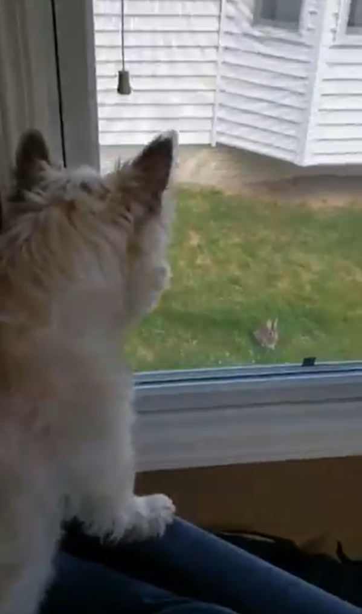

# So you have to build a Site about Rabbits

If you, like many other students, are being forced against your will to make a fan site about rabbits, keep these things in mind:

- The goal is to take an existing HTML page and use CSS to style it in a compelling way
- While it is fine to add content or tweak the existing content or layout to fit your needs, your main focus should be CSS
- Rabbits are awesome
    - Unless they aren't

With these things in mind, your site should work to meet the following requirements:

- It uses one or more CSS files that you have written as a team
- You use `display: grid` and `grid-template-areas` for at least one element on your page
- You use `display: flex` for at least one element on your page
- You use a variety of selectors: element, class, id, nested element selectors, etc.
- You set the font of the page to something custom
- You set the background of the page
- You set the text color of some elements on the page
- You have at least one `@media` query to handle changes in screen size

> **Important Reminder:** Remember that grid and flex will **always** arrange their direct children and will **never** arrange any children nested deeper in the page.
> Remember `display: grid;` and `grid-template-areas` on the grid container and `grid-area` on the children.

Feel free to:

- Add images
- Have fun with this
- Resize or remove the one large image provided
- Add classes and IDs to the HTML
- Add or remove HTML content (again, the focus should be on the CSS, but have fun with it)
- Google things and incorporate things we haven't covered
- Blatantly steal CSS styling from sites on the internet you love

That said, I do discourage you from copying and pasting from prior lecture or exercises. This is meant to be a creative problem-solving effort

At the end, you will share your creation with the class at large and demonstrate its behavior.